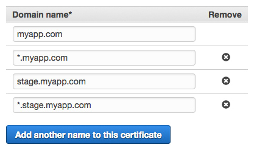
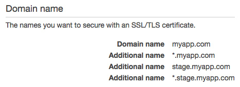
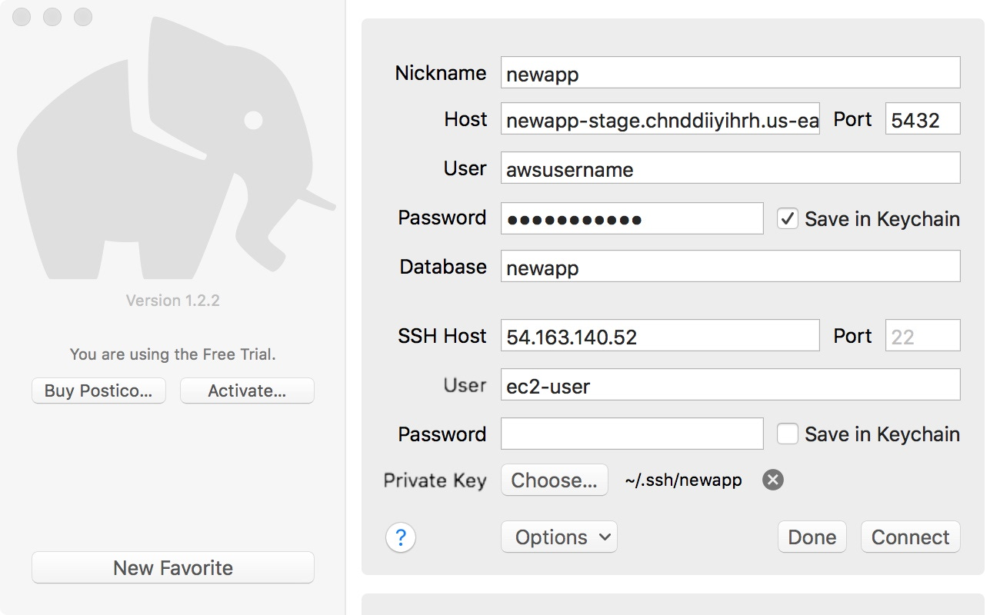
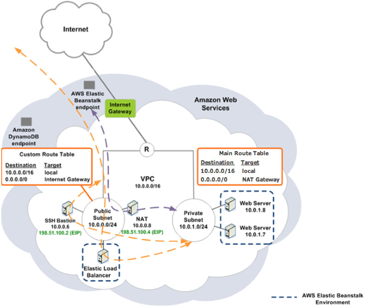

# Web Template

A template for new Rails projects. Assumes the following stack.

- [AWS Elastic Beanstalk](https://aws.amazon.com/elasticbeanstalk)
- [AWS RDS](https://aws.amazon.com/rds)
- [AWS ElastiCache](https://aws.amazon.com/elasticache)
- [Ruby on Rails](http://rubyonrails.org)*

 \* This template assumes the Ruby on Rails EB Solution Stack, but it can be swapped out for another [supported platform](http://docs.aws.amazon.com/elasticbeanstalk/latest/dg/concepts.platforms.html) with minor changes.

## Setup


## AWS

- Aquire an AWS account.

 A. New AWS Account.

 - Sign in to the new AWS account.

 - In IAM, create an account alias and set to [newapp].

 - Apply an IAM password policy. The defaults are fine.

 - Create an Administrator group and attach the AdministratorAccess policy.

 - Create a user account for yourself. Add to Administrators group. Select programmatic and console access types. Store credentials in your _Personal_ vault.

 B. Existing AWS account

 - Request a new user w/ the AdministratorAccess policy attached. Store credentials in _[newapp]_ vault.

- Copy [/terraform](terraform) to the root of your project.

- Update [/terraform/terraform.tfvars](/terraform/terraform.tfvars) and tweak as necessary.

 Example: Comment out ElastiCache if you're not using it.

- [Generate](https://help.github.com/articles/generating-a-new-ssh-key-and-adding-it-to-the-ssh-agent) a _new_ SSH key pair and add it to your ssh-agent. Use your email address and save to: `/Users/[me]/.ssh/[newapp]`. Add a passphrase. Store both keys and the passphrase in the _[newapp]_ vault.

- Install AWS CLI, AWS EB CLI and Terraform

```bash
brew install awscli aws-elasticbeanstalk terraform
```

- Configure AWS CLI

```bash
aws configure --profile [newapp]
AWS Access Key ID [None]: [YOUR_ACCESS_KEY]
AWS Secret Access Key [None]: [YOUR_SECRET_ACCESS_KEY]
Default region name [None]: us-east-1
Default output format [None]: json
```

- Initialize Terraform (inside `/terraform`)

```bash
terraform get
terraform init
```

- Generate and show execution plan.

```bash
terraform plan
```

- If everything looks good, build the infrastructure.

```bash
terraform apply
```

- Party 🎉

### Domain & SSL Certificate

- Aquire Domain

 A. Existing domain, but doesn't have DNS setup.

  - [Transfer](https://console.aws.amazon.com/route53/home#DomainTransfer:) domain to AWS Route 53.

  - TODO: Create Hosted Zone for stage.[myapp].com, [myapp].com, referencing ELB aliases.

 B. Existing domain and DNS setup.

 - Request new CNAME records for stage and prod (i.e. stage.[myapp].com and [myapp].com or [myapp]-stage.domain.com and [myapp].domain.com, etc.) and use the relevant EB environment URLs.

  - Client's DNS must support CNAME at apex / CNAME flattening if we're using [myapp].com, as ELB only provides a DNS name (no IP address, so no A record).

- Aquire SSL Certificate

 - Open the AWS Console, then navigate to: Certificate Manager. Request a certificate for the domain. Additionally, add domains for stage and prod (i.e. stage.[myapp].com or [myapp]-stage.domain.com and [myapp].domain.com, etc.). Adding wildcards for each domain is a good idea too.





 - Wait for domain contact to respond to certificate approval requests from "Amazon Certificates <no-reply@certificates.amazon.com>". Once approved, status will update to "Issued".

 - Uncomment and set `stage_acm_certificate_arn` and `prod_acm_certificate_arn` variables in [/terraform/terraform.tfvars](/terraform/terraform.tfvars). (Grab ARN from the Details section.)

 - Uncomment the "TODO: Create ACM certificate, then uncomment this." settings in [/terraform/elastic_beanstalk.tf](/terraform/elastic_beanstalk.tf).

- Review the execution plan, then apply apply the infrastructure changes.

- Party 🎉

### Accessing Resources in Private Subnets

#### SSH

- Append to `~/.ssh/config`.

```
Host [newapp]-bastion
  HostName [XXX.XXX.XXX.XXX]
  User ec2-user
  ForwardAgent yes

Host [newapp]-stage
  HostName [YYY.YYY.YYY.YYY]
  ProxyCommand ssh -W %h:%p [newapp]-bastion
  User ec2-user

Host [newapp]-prod
  HostName [ZZZ.ZZZ.ZZZ.ZZZ]
  ProxyCommand ssh -W %h:%p [newapp]-bastion
  User ec2-user
```

`[XXX.XXX.XXX.XXX]` Public IP of your bastion. (Output when you run `terraform apply` or `terraform output`.)

`[YYY.YYY.YYY.YYY]` Private IP of the stage instance.

`[ZZZ.ZZZ.ZZZ.ZZZ]` Private IP of a prod instance. There are multiple**, since autoscaling is enabled.

\** To find the Private IP of an EB instance, open the AWS Console, then navigate to: Elastic Beanstalk --> [newapp]-prod --> Health and pick an instance (and note its Instance ID). Then navigate to: EC2 Dashboard --> Running Instances and select the instance. The Private IP will be displayed.

- SSH, SCP, etc.

```bash
ssh [newapp]-dev
scp [newapp]-dev:/var/app/current/dump.csv ~/Desktop/dump.csv
```

#### SQL

- Connect via SSH. Use SSH private key.



### Architecture

This template creates a virtual private cloud (VPC) with public and private subnets. A SSH bastion is created in a public subnet (us-east-1a). Additionally, Elastic Load Balancer (ELB) instances are also created in public subnets. All other resources (EC2, RDS, etc.) are created in private subnets, which aren't publicly accessible. However, developers can access these resources by proxying though the SSH bastion.

Instances in public subnets can send outbound traffic directly to the Internet, whereas instances in private subnets cannot. Instead, they access the Internet via a network address translation (NAT) gateway that resides in a public subnet. So an EC2 instance can make outbound calls to the Internet via a NAT gateway, but the Internet cannot establish inbound connections to the EC2 instance.



[Source](http://docs.aws.amazon.com/elasticbeanstalk/latest/dg/vpc-bastion-host.html)

[Scenario 2: VPC with Public and Private Subnets (NAT)](http://docs.aws.amazon.com/AmazonVPC/latest/UserGuide/VPC_Scenario2.html)

## Circle CI

- Coming soon.
